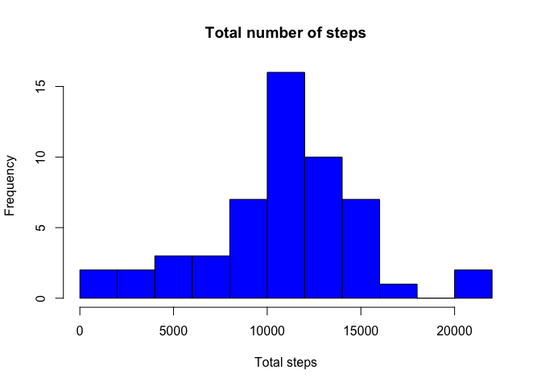
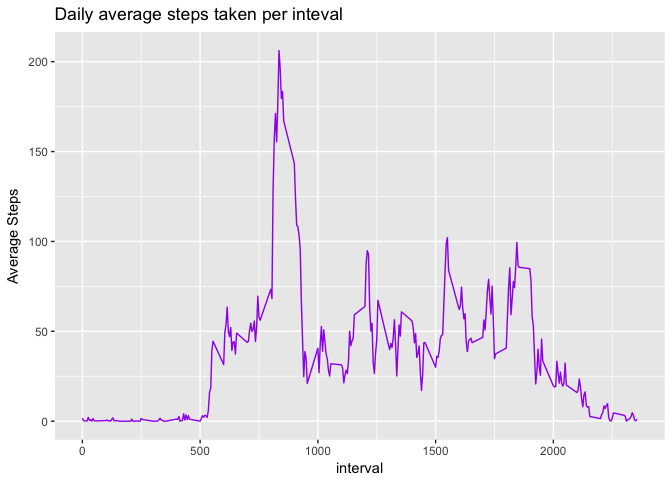
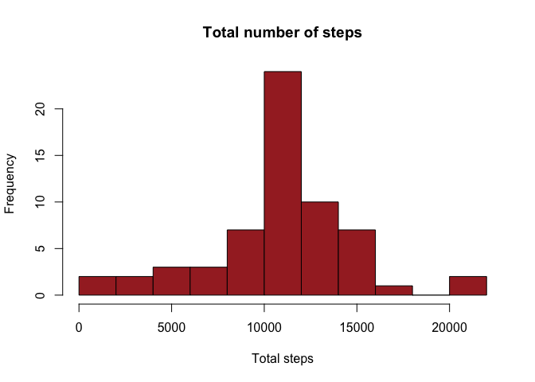
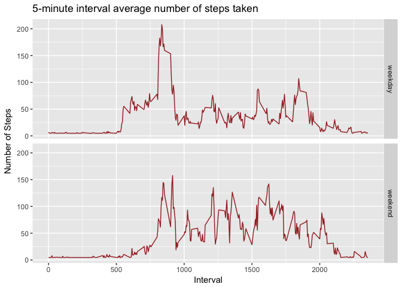

#Reproducible research: Peer graded assignment 1

========================================================

**_1. Loading and preprocessing data_**


```r
dat <- read.csv("activity.csv")
dat$date <- as.Date(as.character(dat$date), format = "%Y-%m-%d")
```

**_2. Total Number of steps per day_**

```r
library(dplyr)
```

```
## 
## Attaching package: 'dplyr'
```

```
## The following objects are masked from 'package:stats':
## 
##     filter, lag
```

```
## The following objects are masked from 'package:base':
## 
##     intersect, setdiff, setequal, union
```

```r
library(knitr)
sub1 <- subset(dat, steps >= 0, select = c(steps, date))
grouped <- group_by(sub1, date)
Totals <- summarise(grouped, Total.Steps = sum(steps, na.rm = TRUE))
kable(Totals, caption = "Total number of steps per day", align = "l", format = "markdown")
```


|date       |Total.Steps |
|:----------|:-----------|
|2012-10-02 |126         |
|2012-10-03 |11352       |
|2012-10-04 |12116       |
|2012-10-05 |13294       |
|2012-10-06 |15420       |
|2012-10-07 |11015       |
|2012-10-09 |12811       |
|2012-10-10 |9900        |
|2012-10-11 |10304       |
|2012-10-12 |17382       |
|2012-10-13 |12426       |
|2012-10-14 |15098       |
|2012-10-15 |10139       |
|2012-10-16 |15084       |
|2012-10-17 |13452       |
|2012-10-18 |10056       |
|2012-10-19 |11829       |
|2012-10-20 |10395       |
|2012-10-21 |8821        |
|2012-10-22 |13460       |
|2012-10-23 |8918        |
|2012-10-24 |8355        |
|2012-10-25 |2492        |
|2012-10-26 |6778        |
|2012-10-27 |10119       |
|2012-10-28 |11458       |
|2012-10-29 |5018        |
|2012-10-30 |9819        |
|2012-10-31 |15414       |
|2012-11-02 |10600       |
|2012-11-03 |10571       |
|2012-11-05 |10439       |
|2012-11-06 |8334        |
|2012-11-07 |12883       |
|2012-11-08 |3219        |
|2012-11-11 |12608       |
|2012-11-12 |10765       |
|2012-11-13 |7336        |
|2012-11-15 |41          |
|2012-11-16 |5441        |
|2012-11-17 |14339       |
|2012-11-18 |15110       |
|2012-11-19 |8841        |
|2012-11-20 |4472        |
|2012-11-21 |12787       |
|2012-11-22 |20427       |
|2012-11-23 |21194       |
|2012-11-24 |14478       |
|2012-11-25 |11834       |
|2012-11-26 |11162       |
|2012-11-27 |13646       |
|2012-11-28 |10183       |
|2012-11-29 |7047        |

```r
hist(Totals$Total.Steps, xlab = "Total steps", main = "Total number of steps", col = "blue", breaks = 8)
```

<!-- -->

```r
mean.med <- summarise(grouped, Mean = round(mean(steps, na.rm = TRUE)), Median = median(steps, na.rm = TRUE))
kable(mean.med, caption = "Mean and Median steps per day", align = "c", format = "markdown")
```


|    date    | Mean | Median |
|:----------:|:----:|:------:|
| 2012-10-02 |  0   |   0    |
| 2012-10-03 |  39  |   0    |
| 2012-10-04 |  42  |   0    |
| 2012-10-05 |  46  |   0    |
| 2012-10-06 |  54  |   0    |
| 2012-10-07 |  38  |   0    |
| 2012-10-09 |  44  |   0    |
| 2012-10-10 |  34  |   0    |
| 2012-10-11 |  36  |   0    |
| 2012-10-12 |  60  |   0    |
| 2012-10-13 |  43  |   0    |
| 2012-10-14 |  52  |   0    |
| 2012-10-15 |  35  |   0    |
| 2012-10-16 |  52  |   0    |
| 2012-10-17 |  47  |   0    |
| 2012-10-18 |  35  |   0    |
| 2012-10-19 |  41  |   0    |
| 2012-10-20 |  36  |   0    |
| 2012-10-21 |  31  |   0    |
| 2012-10-22 |  47  |   0    |
| 2012-10-23 |  31  |   0    |
| 2012-10-24 |  29  |   0    |
| 2012-10-25 |  9   |   0    |
| 2012-10-26 |  24  |   0    |
| 2012-10-27 |  35  |   0    |
| 2012-10-28 |  40  |   0    |
| 2012-10-29 |  17  |   0    |
| 2012-10-30 |  34  |   0    |
| 2012-10-31 |  54  |   0    |
| 2012-11-02 |  37  |   0    |
| 2012-11-03 |  37  |   0    |
| 2012-11-05 |  36  |   0    |
| 2012-11-06 |  29  |   0    |
| 2012-11-07 |  45  |   0    |
| 2012-11-08 |  11  |   0    |
| 2012-11-11 |  44  |   0    |
| 2012-11-12 |  37  |   0    |
| 2012-11-13 |  25  |   0    |
| 2012-11-15 |  0   |   0    |
| 2012-11-16 |  19  |   0    |
| 2012-11-17 |  50  |   0    |
| 2012-11-18 |  52  |   0    |
| 2012-11-19 |  31  |   0    |
| 2012-11-20 |  16  |   0    |
| 2012-11-21 |  44  |   0    |
| 2012-11-22 |  71  |   0    |
| 2012-11-23 |  74  |   0    |
| 2012-11-24 |  50  |   0    |
| 2012-11-25 |  41  |   0    |
| 2012-11-26 |  39  |   0    |
| 2012-11-27 |  47  |   0    |
| 2012-11-28 |  35  |   0    |
| 2012-11-29 |  24  |   0    |

**_3. Average daily activity_**

```r
library(ggplot2)
sub2 <- subset(dat, steps >= 0, select = c(steps, interval))
grouped2 <- group_by(sub2, interval)
daily_interval_avg <- summarise(grouped2, Avg.Steps = mean(steps))
g <- ggplot(daily_interval_avg, aes(interval, Avg.Steps))
g+geom_line(colour = "purple")+ggtitle("Daily average steps taken per inteval")+ ylab("Average Steps")
```

<!-- -->

```r
i <- which.max(daily_interval_avg$Avg.Steps)
daily_interval_avg$interval[i]
```

```
## [1] 835
```

The interval with maximun number of steps averaged by all days is 835

**_4. Missing values_**

```r
icc <- !complete.cases(dat)
Nas <- sum(icc)
```
There are 2304 rows with missing values

```r
dat1 <- dat
m <- round(mean(dat1[,1], na.rm = TRUE))
for(i in 1: nrow(dat1)){
        if (is.na(dat1[i,1]) == TRUE){
            dat1[i,1] <- m
        }else{
                dat1[i,1] <- dat1[i,1]
        }
}
Totals1 <- summarise(group_by(subset(dat1, select = c(steps,date)),date), Total.Steps = sum(steps, na.rm = TRUE))
hist(Totals1$Total.Steps, xlab = "Total steps", main = "Total number of steps", col = "brown", breaks = 8)
```

<!-- -->

```r
mean.med1 <- summarise(group_by(subset(dat1, select = c(steps,date)),date), Mean = round(mean(steps, na.rm = TRUE)), Median = median(steps, na.rm = TRUE))
kable(mean.med1, caption = "Mean and Median steps per day", align = "c", format = "markdown")
```


|    date    | Mean | Median |
|:----------:|:----:|:------:|
| 2012-10-01 |  37  |   37   |
| 2012-10-02 |  0   |   0    |
| 2012-10-03 |  39  |   0    |
| 2012-10-04 |  42  |   0    |
| 2012-10-05 |  46  |   0    |
| 2012-10-06 |  54  |   0    |
| 2012-10-07 |  38  |   0    |
| 2012-10-08 |  37  |   37   |
| 2012-10-09 |  44  |   0    |
| 2012-10-10 |  34  |   0    |
| 2012-10-11 |  36  |   0    |
| 2012-10-12 |  60  |   0    |
| 2012-10-13 |  43  |   0    |
| 2012-10-14 |  52  |   0    |
| 2012-10-15 |  35  |   0    |
| 2012-10-16 |  52  |   0    |
| 2012-10-17 |  47  |   0    |
| 2012-10-18 |  35  |   0    |
| 2012-10-19 |  41  |   0    |
| 2012-10-20 |  36  |   0    |
| 2012-10-21 |  31  |   0    |
| 2012-10-22 |  47  |   0    |
| 2012-10-23 |  31  |   0    |
| 2012-10-24 |  29  |   0    |
| 2012-10-25 |  9   |   0    |
| 2012-10-26 |  24  |   0    |
| 2012-10-27 |  35  |   0    |
| 2012-10-28 |  40  |   0    |
| 2012-10-29 |  17  |   0    |
| 2012-10-30 |  34  |   0    |
| 2012-10-31 |  54  |   0    |
| 2012-11-01 |  37  |   37   |
| 2012-11-02 |  37  |   0    |
| 2012-11-03 |  37  |   0    |
| 2012-11-04 |  37  |   37   |
| 2012-11-05 |  36  |   0    |
| 2012-11-06 |  29  |   0    |
| 2012-11-07 |  45  |   0    |
| 2012-11-08 |  11  |   0    |
| 2012-11-09 |  37  |   37   |
| 2012-11-10 |  37  |   37   |
| 2012-11-11 |  44  |   0    |
| 2012-11-12 |  37  |   0    |
| 2012-11-13 |  25  |   0    |
| 2012-11-14 |  37  |   37   |
| 2012-11-15 |  0   |   0    |
| 2012-11-16 |  19  |   0    |
| 2012-11-17 |  50  |   0    |
| 2012-11-18 |  52  |   0    |
| 2012-11-19 |  31  |   0    |
| 2012-11-20 |  16  |   0    |
| 2012-11-21 |  44  |   0    |
| 2012-11-22 |  71  |   0    |
| 2012-11-23 |  74  |   0    |
| 2012-11-24 |  50  |   0    |
| 2012-11-25 |  41  |   0    |
| 2012-11-26 |  39  |   0    |
| 2012-11-27 |  47  |   0    |
| 2012-11-28 |  35  |   0    |
| 2012-11-29 |  24  |   0    |
| 2012-11-30 |  37  |   37   |

**_Weekdays Vs Weekends_**


```r
dat1 <- mutate(dat1, Weekday = weekdays(dat1$date))
for(i in 1:nrow(dat1)){
        if(dat1[i,4] ==  "Saturday" | dat1[i,4] == "Sunday"){
                dat1[i,4] <- "weekend"
        }else if(dat1[i,4] == "Monday" | dat1[i,4] == "Tuesday" | dat1[i,4] == "Wednesday" | dat1[i,4] == "Thursday" | dat1[i,4] == "Friday"){
                dat1[i,4] <- "weekday"
        }
}
dat1$Weekday <- as.factor(dat1$Weekday)
```


```r
sub3 <- subset(dat1, select = c(steps, interval, Weekday))
grouped3 <- group_by(sub3, Weekday, interval)
interval_Avg.Steps <- summarise(grouped3, Avg.Steps = mean(steps))
g <- ggplot(interval_Avg.Steps, aes(interval, Avg.Steps))
g <- g + geom_line(colour = "brown") +facet_grid(Weekday ~.)
g <- g+ xlab("Interval") + ylab("Number of Steps") + ggtitle("5-minute interval average number of steps taken")
g
```

<!-- -->

* Weekends have more steps taken across most 5-minute intervals than weekdays
* Weekdays have the interval with the highest number of steps 
